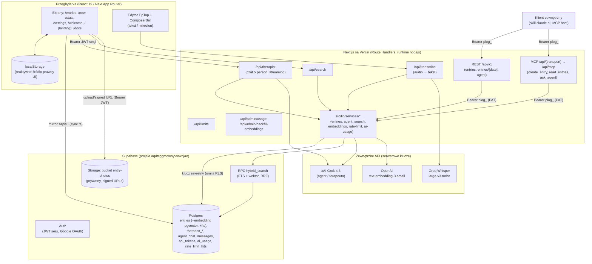

# Architektura systemu — ProLog

> Dokument opisuje rzeczywistą architekturę aplikacji na podstawie plików w repozytorium
> (`package.json`, `next.config.ts`, `src/**`, `supabase/migrations/**`, `.github/workflows/ci.yml`,
> nazwy zmiennych z `.env.local`). Fragmenty, których nie dało się potwierdzić z plików,
> oznaczono jako **[do weryfikacji]**. Wartości sekretów nie są tu wypisywane — tylko nazwy i role.

## 1. Przegląd systemu

ProLog to osobista aplikacja-dziennik (journaling) w stylu stoickim, zbudowana na Next.js 16
(App Router, React 19). Użytkownik prowadzi wpisy dzienne (treść + metryki: nastrój, sen, energia,
produktywność, stres), może dodawać do nich zdjęcia oraz rozmawiać z „cyfrowym psychoterapeutą"
(persona Freuda i inne) opartym o model xAI Grok. Wpisy są lustrzane z `localStorage` przeglądarki
do bazy Supabase (Postgres), gdzie każdy wpis dostaje wektor semantyczny (embedding OpenAI) zapisany
w pgvector — dzięki temu działa **wyszukiwanie hybrydowe** (full-text + wektor, fuzja RRF), które
zasila zarówno wyszukiwarkę UI, jak i **RAG** agenta. Te same operacje (tworzenie wpisów, odczyt dnia,
pytanie do agenta) są wystawione na zewnątrz przez **REST API** (`/api/v1`) oraz **serwer MCP**
(`/api/mcp`), uwierzytelniane Personal Access Tokenem.

## 2. Diagram architektury



## 3. Komponenty

| Komponent | Odpowiedzialność | Technologia |
|---|---|---|
| **Frontend / UI** | Ekrany dziennika (`/entries` master-detail, `/new`, `/stats`, `/settings`, `/welcome`), landing `/` (3D popiersie three.js), `/docs` | Next.js 16 App Router, React 19, Tailwind 4, Radix UI, `next-themes` (tryb jasny/ciemny) |
| **Edytor wpisu** | Tworzenie/edycja treści (HTML), pasek narzędzi, dodawanie zdjęć, ComposerBar z mikrofonem | TipTap 3 (`@tiptap/*`) |
| **Warstwa localStorage + mirror** | `localStorage` = reaktywne źródło prawdy UI; każdy zapis fire-and-forget pchany do Supabase pod `user_id` | `src/lib/storage.ts`, `src/lib/sync.ts`, `src/lib/seed.ts` |
| **REST API `/api/v1`** | Zewnętrzne operacje: `entries` (create), `entries/[date]` (read), `agent` (ask) | Next Route Handlers, `runtime=nodejs`, Zod |
| **Serwer MCP `/api/mcp`** | Te same operacje jako narzędzia MCP: `create_entry`, `read_entries`, `ask_agent` | `mcp-handler`, `@modelcontextprotocol/sdk` (Streamable HTTP) |
| **`/api/therapist`** | Czat z cyfrowym terapeutą (5 person), efekt „pisania", kontekst RAG | Route Handler + xAI Grok |
| **`/api/transcribe`** | Transkrypcja audio z mikrofonu (tylko zalogowani, rate-limit) | Route Handler + Groq Whisper |
| **`/api/search`** | Wyszukiwanie hybrydowe dla UI | Route Handler + serwis `search` |
| **`/api/limits`** | Stan dziennego limitu AI dla UI (ostrzeżenia 80%, blokada) | Route Handler + serwis `rate-limit` |
| **`/api/admin/*`** | Panel zużycia AI (`usage`) i backfill embeddingów — tylko właściciel | Route Handler, gating po e-mailu |
| **Warstwa serwisów** | Wspólna logika domenowa (zero duplikacji REST/MCP/UI): `entries`, `agent`, `search`, `embeddings`, `rate-limit`, `ai-usage` | `src/lib/services/*`, klient `supabase-admin` |
| **Warstwa auth** | Dwa tryby: PAT (`api-auth.ts`, prefiks `plog_`) dla REST/MCP; JWT sesji (`user-auth.ts`) dla wewnętrznych funkcji AI | `node:crypto`, supabase-js |
| **Bezpieczeństwo treści** | Sanityzacja HTML wpisów (anti-XSS) przy zapisie i renderze | `src/lib/sanitize.ts`, `isomorphic-dompurify` |

## 4. Źródła danych

### Postgres (Supabase, projekt `aqdtcggmownyvsnxnjao`)

| Tabela | Co przechowuje | Jak odpytywana |
|---|---|---|
| `public.entries` | Wpisy: `title`, `content` (HTML), metryki 1–5, `embedding vector(1536)`, kolumna generowana `fts tsvector`, `photos` (JSON referencji) | UI przez supabase-js (RLS `auth.uid()=user_id`); serwisy przez klucz sekretny (jawny filtr `user_id`) |
| `public.agent_chat_messages` | Historia rozmów agenta REST/MCP **per dzień** (`role`, `content`, `day`) | Serwis `agent` (klucz sekretny) |
| `public.therapist_conversations` / `therapist_messages` | Rozmowy terapeuty w UI (osobny wątek/wiadomości) | `/api/therapist`, `therapist-*` w `src/lib` |
| `public.api_tokens` | Hash SHA-256 Personal Access Tokenów (prefiks `plog_`), nigdy plaintext | Weryfikacja w `api-auth.ts` |
| `public.ai_usage` | Log zużycia AI per użytkownik (endpoint, model, tokeny) | Zapis best-effort z serwisów; odczyt w `/api/admin/usage` |
| `public.rate_limit_hits` | Liczniki rate-limit (jeden wiersz = jedno żądanie AI), okno minutowe + dzienne | Serwis `rate-limit` (tylko klucz sekretny; RLS z jawną polityką `restrictive` deny-all dla `anon`/`authenticated`) |

**Indeksy / wektory:** `entries_embedding_hnsw` (HNSW, cosinus) na kolumnie `embedding`;
`entries_fts_idx` (GIN) na `fts`; rozszerzenia `vector` i `unaccent` w schemacie `extensions`.
Funkcja RPC `public.hybrid_search(p_user_id, query_text, query_embedding, match_count, …)` łączy
top-N full-text z top-N wektora **fuzją RRF**; warstwa TS dokłada zawsze okno „ostatnich 7 dni".

### Storage

- **Bucket `entry-photos`** — **prywatny**. Ścieżka obiektu `${userId}/${uuid}.${ext}`. RLS na
  `storage.objects` ogranicza dostęp do obiektów, których pierwszy segment ścieżki = `auth.uid()`.
  Podgląd przez **signed URLs** (TTL 3600 s). Upload tylko dla zalogowanych.

### Zewnętrzne API jako źródło danych

- **OpenAI `text-embedding-3-small`** (1536D) — embeddingi wpisów (auto przy tworzeniu + backfill).
- **xAI Grok 4.3** — generuje odpowiedzi agenta/terapeuty.
- **Groq Whisper `large-v3-turbo`** — zamiana audio na tekst.

## 5. Integracje i połączenia

| Integracja | Kierunek | Uwierzytelnianie (typ, nie sekret) |
|---|---|---|
| **REST `/api/v1`** | IN (klient zewn. → ProLog) | `Authorization: Bearer plog_…` (Personal Access Token, hash w `api_tokens`) |
| **MCP `/api/mcp`** | IN (host MCP / skill claude.ai → ProLog) | ten sam PAT przez `withMcpAuth` (`required: true`); `clientId` niesie `userId` |
| **Supabase Auth** | IN/OUT | JWT sesji przeglądarki; logowanie m.in. **Google OAuth** **[do weryfikacji: pełna lista providerów w panelu]** |
| **Supabase Postgres/Storage** | OUT (ProLog → Supabase) | przeglądarka: anon key + RLS; serwer: klucz sekretny (omija RLS) |
| **xAI** | OUT | `Bearer $XAI_API_KEY` (serwer), `https://api.x.ai/v1/chat/completions` |
| **OpenAI** | OUT | `Bearer $OPENAI_API_KEY` (serwer), `https://api.openai.com/v1/embeddings` |
| **Groq** | OUT | `Bearer $GROQ_API_KEY` (serwer), `https://api.groq.com/openai/v1/audio/transcriptions` |

**Zmienne środowiskowe** (nazwy + rola; wartości pominięte):

| Nazwa | Rola |
|---|---|
| `NEXT_PUBLIC_SUPABASE_URL` | URL projektu Supabase (klient) |
| `NEXT_PUBLIC_SUPABASE_ANON_KEY` | Publiczny klucz anon (klient, działa pod RLS) |
| `SUPABASE_SECRET_KEY` | Serwerowy klucz sekretny (omija RLS; nowy typ `sb_secret_`) |
| `SUPABASE_SERVICE_ROLE_KEY` | Serwerowy klucz service-role (legacy; obecny w `.env.local`) **[do weryfikacji: który jest faktycznie używany w prod]** |
| `XAI_API_KEY` | Serwer — agent / terapeuta (Grok) |
| `OPENAI_API_KEY` | Serwer — embeddingi |
| `GROQ_API_KEY` | Serwer — transkrypcja |
| `PROLOG_ADMIN_EMAILS` | (opcjonalna, z kodu) lista e-maili z dostępem do panelu zużycia; domyślnie właściciel |

## 6. Przepływ danych

**Tworzenie wpisu (UI):** użytkownik pisze w edytorze → zapis do `localStorage` (natychmiastowy
render) → `sync.ts` (fire-and-forget) pcha wiersz do `entries` pod `user_id` sesji → embedding
domykany best-effort (auto w `createEntry` po stronie serwisów lub `backfillEmbeddingsForUser`
przed wyszukiwaniem). Zdjęcia: upload do bucketa `entry-photos` pod `${userId}/…`, referencje
w `entries.photos`; podgląd przez signed URL.

**Tworzenie/odczyt przez API/MCP:** klient z PAT → `/api/v1/entries` lub narzędzie MCP
`create_entry`/`read_entries` → wspólny serwis `entries` (klucz sekretny) → `entries`.

**Pytanie do agenta (RAG):** pytanie → serwis `agent` → `hybridSearch(userId, question)` liczy
embedding pytania (OpenAI), woła RPC `hybrid_search` (RRF) + dokłada okno 7 dni →
`buildJournalContextFromHits` montuje kontekst → wiadomości (system prompt persony + kontekst +
historia dnia z `agent_chat_messages`) → xAI Grok → odpowiedź; wymiana zapisana do historii,
zużycie do `ai_usage`. **Degradacja:** gdy wyszukiwanie/embedding padnie (np. brak `OPENAI_API_KEY`),
agent przełącza się na pełny dziennik — endpoint nie może paść.

**Transkrypcja:** audio z mikrofonu → `/api/transcribe` (wymaga JWT sesji + rate-limit) → Groq
Whisper → tekst wraca do ComposerBar.

**Bramki human-in-the-loop:** brak automatycznych akcji wykonywanych bez użytkownika — agent jedynie
zwraca tekst (nie modyfikuje danych). Operacje zapisu/usuwania wpisów i zdjęć inicjuje użytkownik w UI
albo uwierzytelniony klient API. Funkcje AI są bramkowane logowaniem (JWT) i limitami (UI ostrzega
przy 80% i blokuje po wyczerpaniu dziennego limitu).

## 7. Hosting i deployment

- **Hosting:** Vercel (obecny katalog `.vercel/`, README z sekcją Vercel; produkcja pod
  `https://prologweek1.vercel.app` — homepage repo). Brak `Dockerfile`/`docker-compose.yml` — **nie**
  jest konteneryzowane; brak crona/tmux w repo.
- **Runtime funkcji:** Route Handlers Next.js z `runtime = "nodejs"` (wymagane przez `node:crypto`
  w warstwie auth oraz MCP). MCP `maxDuration: 60`.
- **Build/dev:** `npm run dev` / `next build` / `next start` (dev i start z flagą
  `node --use-system-ca`).
- **Baza:** migracje SQL w `supabase/migrations/` (11 plików) stosowane na projekcie
  `aqdtcggmownyvsnxnjao`; pgvector + HNSW + GIN.
- **CI:** GitHub Actions (`.github/workflows/ci.yml`) na push do `main` i każdy PR — Node 20,
  `npm ci`, **lint → typecheck → testy (Vitest)**. Bez sekretów i bez kroku build; deploy pozostaje
  po stronie Vercela. **[do weryfikacji: konfiguracja połączenia Vercel↔GitHub i region funkcji]**

## 8. Otwarte pytania / TODO

- **Który klucz Supabase działa w produkcji** — w `.env.local` są obie nazwy (`SUPABASE_SECRET_KEY`
  i `SUPABASE_SERVICE_ROLE_KEY`); preferowany jest sekretny `sb_secret_`, ale faktyczny stan env na
  Vercelu **[do weryfikacji]**.
- **Pełna lista providerów logowania** w Supabase Auth (potwierdzony Google OAuth) — **[do weryfikacji w panelu]**.
- **Dwa modele historii rozmów** — agent REST/MCP używa `agent_chat_messages` (per dzień), a terapeuta
  w UI `therapist_conversations`/`therapist_messages`; relacja/rozgraniczenie odpowiedzialności do
  potwierdzenia.
- **Region/limity funkcji Vercel** oraz powiązanie auto-deploy z gałęzią `main` — nie wynika z plików repo.
- **Stan bezpieczeństwa** (advisory Supabase): polityka deny-all dla `rate_limit_hits` **wdrożona**
  (migracja `…_rate_limit_hits_deny_policies` — ostrzeżenie zniknęło); polityka haseł wzmocniona
  (min. 8 znaków + złożoność). Pozostaje WARN `auth_leaked_password_protection` — funkcja
  HaveIBeenPwned wymaga planu **Pro**, więc na FREE nie da się jej włączyć (do włączenia po upgrade).
```
